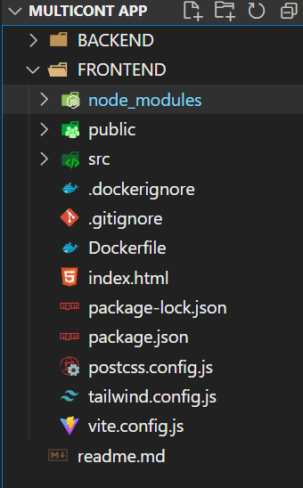
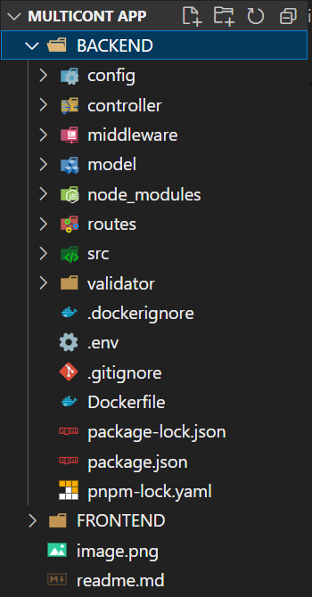
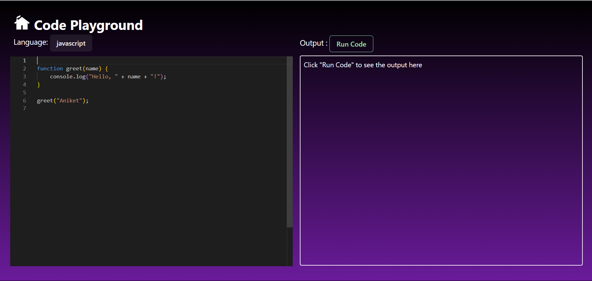
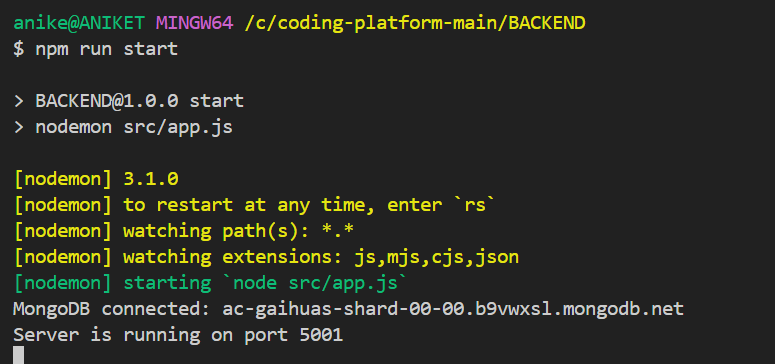

# Containerizing a Three-Tier Application with Docker: A Comprehensive Guide

## Table of Contents
1. [Introduction](#introduction)
2. [Prerequisites](#prerequisites)
3. [Step 1: Setting Up the Project Structure](#step-1-setting-up-the-project-structure)
4. [Step 2: Developing the Components](#step-2-developing-the-components)
5. [Step 3: Dockerizing Each Component](#step-3-dockerizing-each-component)
6. [Step 4: Building Docker Images](#step-4-building-docker-images)
7. [Step 5: Setting Up Docker Compose](#step-5-setting-up-docker-compose)
8. [Step 6: Running the Application](#step-6-running-the-application)
9. [Conclusion](#conclusion)

## Introduction

Welcome to my comprehensive guide on containerizing a three-tier application with Docker! In this blog, I'll break down the process of containerization into simple steps, making it easy for anyone to understand and follow along.

## Understanding Three-Tier Application Architecture

But first, let's understand what we mean by a "three-tier application" and why containerization with Docker is such a powerful tool for managing it.

A **three-tier application** is a type of software architecture that consists of three distinct layers:

- **Presentation Layer**: Also known as the user interface, this layer is responsible for displaying information to users and handling user input.
  
- **Application Logic Layer**: This layer contains the business logic of the application. It processes requests from the presentation layer, interacts with the database, and performs calculations or manipulations as necessary.
  
- **Data Storage Layer**: This layer, often implemented as a database, is responsible for storing and retrieving data used by the application.

Each layer serves a specific function and communicates with the other layers to deliver a fully functional application.

## The Power of Docker and Containerization

### What is Docker?

**Docker** is an open-source platform that automates the deployment of applications inside **containers**. It was first released in 2013 and has since become one of the most popular tools for containerization due to its ease of use and robust features.

### How do Containers Work?

Containers are lightweight, portable, and self-sufficient environments that contain everything needed to run an application, including code, runtime, system tools, libraries, and settings. 

They leverage **containerization** technology to package software in a way that ensures consistency across different environments, regardless of the underlying infrastructure.

### Key Concepts in Docker

1. **Docker Image**: An image is a lightweight, standalone, executable package that includes everything needed to run a piece of software, including the code, runtime, libraries, and dependencies.

2. **Docker Container**: A container is a running instance of a Docker image. It encapsulates the application and its dependencies, providing isolation and ensuring that the application runs consistently across different environments.

3. **Dockerfile**: A Dockerfile is a text file that contains instructions for building a Docker image. It specifies the base image, the dependencies to install, and the commands to run when the container starts.

4. **Docker Hub**: Docker Hub is a cloud-based repository where users can store and share Docker images. It provides access to a vast library of pre-built images, making it easy to get started with Docker.

### Advantages of Docker and Containers

1. **Resource Efficiency**: Containers share the host system's kernel, which reduces overhead and improves resource utilization compared to traditional virtual machines.

2. **Speed and Portability**: Containers can be created and deployed quickly, making them ideal for continuous integration and continuous deployment (CI/CD) pipelines. They can also be easily moved and deployed across different environments, from development to production.

3. **Dependency Management**: Containers encapsulate dependencies, making it easy to manage and version control software components. This simplifies deployment and eliminates "it works on my machine" issues.

4. **Microservices Architecture**: Docker and containers are well-suited for microservices architectures, where applications are broken down into smaller, loosely coupled services. Each service can be packaged and deployed independently in its own container.

## Getting Started with Docker

To get started with Docker, you'll need to install the Docker Engine on your system. You can download Docker Desktop for Windows or Mac, or install Docker Engine on Linux.

Once Docker is installed, you can start using Docker commands to build, run, and manage containers. Here are a few basic commands to get you started:

- `docker build`: Build an image from a Dockerfile.
- `docker run`: Run a container from an image.
- `docker ps`: List running containers.
- `docker stop`: Stop a running container.
- `docker rm`: Remove a container.
- `docker images`: List Docker images.

With these commands, you can start experimenting with Docker and containerization, and unlock the full potential of modern application development and deployment.

Happy containerizing!

## What You'll Learn in This Guide

Throughout this guide, we'll walk you through the process of containerizing each layer of the three-tier application, from the presentation layer to the data storage layer. By the end, you'll have a clear understanding of how Docker can revolutionize the way you develop and deploy applications.

So, let's dive in and explore the world of containerization with Docker!


## Prerequisites
Before we dive into the tutorial, ensure you have Docker installed on your system. If not, you can download and install Docker from the official website: [Docker Official Website](https://www.docker.com/get-started)

## Step 1: Setting Up the Project Structure
To begin, let's create a directory for our project and organize it into separate folders for the frontend, backend, and database components. This structured approach will facilitate the development and containerization process.
Or to make it easier, you can clone this repository and follow the steps below.

```bash
git clone [repository-url]
```

### The project structure should look like this:

##### 1. FRONTEND



##### 1. BACKEND

## Step 2: Developing the Components
In this step, we'll develop each component of our three-tier application. We can  create a simple frontend using a popular framework like React, set up a backend server using Node.js and Express.js, and configure MongoDB as our database.In my case I have already cloned the repository and will be using the following steps to create the components.

### Frontend Development
For the frontend, I have used React.js.Execute the following command to set up the React app.Navigate to the FRONTEND directory.

```bash
cd FRONTEND
npm install
```
Once the installation is complete, you can start the development server using the following command:
```bash
npm run dev
```
### Backend Development
For the backend, I have used Node.js and Express.js.Navigate to the BACKEND directory and write the following commands to set up the backend server.

```bash
cd BACKEND
pnpm init -y
```

Once the installation is complete, you can start the development server using the following command:
```bash
npm run start
```
Initialize a new Node.js project and install Express.js:
```bash
npm init -y
npm install express
```
Create a file named `server.js` and add the following code:

### Database Configuration
For the database, we'll use MongoDB. You can either install MongoDB locally or use a cloud-based service like MongoDB Atlas. Make sure you have the connection URI handy.

### Setting up the .env file
Create a file named `.env` in the `backend` directory and add the following content:
```bash
MONGO_URI="mongodb+srv://<username>:<password>@cluster1.b9vwxsl.mongodb.net/"
ACCESS_TOKEN_SECRET=somenew
REFRESH_TOKEN_SECRET=somenewtoken
```

## Step 3: Dockerizing Each Component
Now, let's containerize each component by creating Dockerfiles. A Dockerfile is a text document that contains instructions for building a Docker image. We'll create Dockerfiles for the frontend and backend, specifying the necessary dependencies and commands to run the applications within containers.

### Frontend Dockerfile
Create a file named `Dockerfile` inside the `frontend` directory and add the following content:
```Dockerfile
FROM node:latest

WORKDIR /app

COPY . .

RUN npm install 

EXPOSE 8080

CMD [ "npm", "run", "dev","--","--host","0.0.0.0"]

```

### Backend Dockerfile
Create a file named `Dockerfile` inside the `backend` directory and add the following content:
```Dockerfile
FROM node:latest

WORKDIR /

COPY . .

RUN npm install

EXPOSE 5001

CMD ["npm", "run", "start"]

```
### Configuration to be done in vite.config.js in Frontend
```js
import { defineConfig } from 'vite'
import react from '@vitejs/plugin-react'

// https://vitejs.dev/config/
export default defineConfig({
  plugins: [react()],
  server: {
    watch: {
      usePolling: true,
    },
    host: true, // needed for the Docker Container port mapping to work
    strictPort: true,
    port: 8080 // you can replace this port with any port
  }
})
```
## Step 4: Building Docker Images
With our Dockerfiles in place, we'll build Docker images for the frontend and backend components. Building Docker images involves executing the instructions defined in the Dockerfiles to create immutable snapshots of our applications and their environments.

### Building Frontend Image
Navigate to the `FRONTEND` directory and run the following command:
```bash
docker build -t aniket2409/21bcp229-aniket-frontend .
```

### Building Backend Image
Navigate to the `BACKEND` directory and run the following command:
```bash
docker build -t aniket2409/21bcp229-aniket-backend .
```

## Step 5: Setting Up Docker Compose
Docker Compose is a tool for defining and running multi-container Docker applications. In this step, we'll leverage Docker Compose to orchestrate the deployment of our three-tier application. We'll define the services for the frontend, backend, and database components in a docker-compose.yml file, specifying their configurations and dependencies.

### Creating Docker Compose File
Create a file named `docker-compose.yml` in the root directory of your project and add the following content:
```yaml
version: '3'

services:
  frontend:
    image: aniket2409/21bcp229-aniket-frontend
    ports:
      - "8080:8080"

  backend:
    image: aniket2409/21bcp229-aniket-backend
    ports:
      - "5000:5001"
    depends_on:
      - mongodb
    environment:
      - MONGO_URI=<mongo_uri> # Add your MongoDB connection URI here

  mongodb:
    image: mongo
    container_name: mongodb
    ports:
      - "27017:27017"
    environment:
      - MONGO_INITDB_DATABASE=test
      - MONGO_INITDB_ROOT_USERNAME=<mongo_user> # Add your MongoDB username here
      - MONGO_INITDB_ROOT_PASSWORD=<mongo_password> # Add your MongoDB password here

```

## Step 6: Running the Application
With Docker Compose configured, we'll launch our three-tier application using a single command. Docker Compose will handle the creation and management of the containers, ensuring seamless communication between the frontend, backend, and database components.

### Launching the Application
Navigate to the root directory of your project and run the following command:
```bash
docker-compose up
```
## Accessing the Application

### 1. FRONTEND

#### a. Homepage


#### a. CodeEditor


### 2. BACKEND

#### a. Starting of the backend server

## Conclusion
In conclusion, containerizing a three-tier application with Docker offers numerous benefits, including improved portability, scalability, and resource efficiency. By following the steps outlined in this tutorial, you've gained valuable insights into the containerization process and learned how to leverage Docker to streamline the deployment of complex applications. As you continue to explore the world of containerization, remember to experiment, iterate, and embrace the transformative power of Docker in modern software development.
